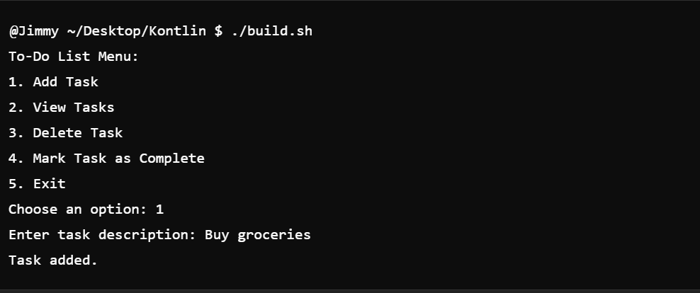
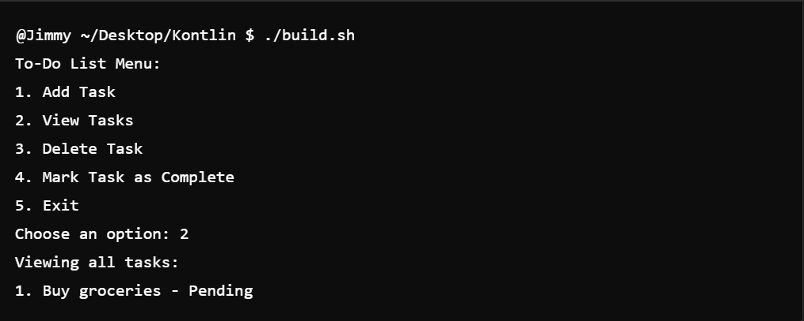
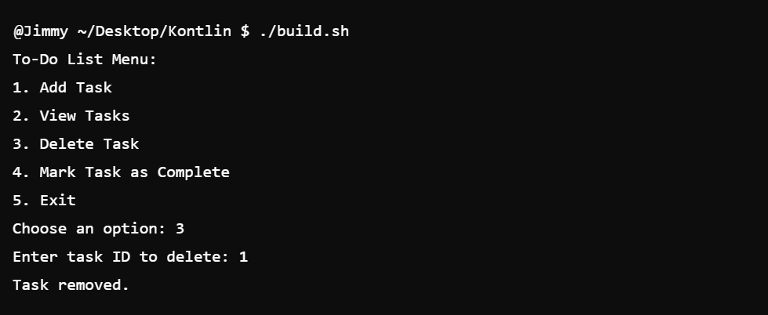
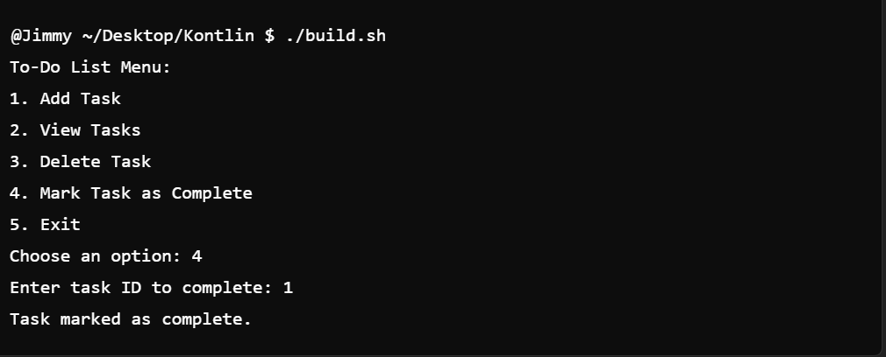
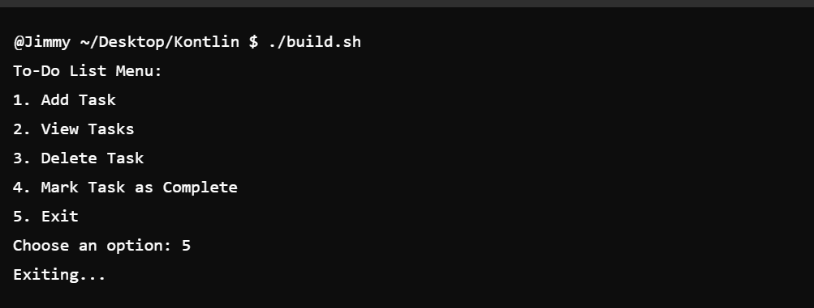

# To-Do List Application in Kotlin

## Overview

This is a simple console-based To-Do List application written in Kotlin. It allows users to manage their tasks by adding, viewing, deleting, and marking them as complete.

## Features

- **Add Task**: Users can add new tasks with descriptions.
- **View Tasks**: Users can view all tasks with their statuses (Pending or Completed).
- **Delete Task**: Users can delete a task by its ID.
- **Complete Task**: Users can mark a task as completed by its ID.
- **Exit**: Exits the application.

## Screenshots

### Adding a Task



### Viewing Tasks



### Deleting a Task



### Completing a Task



### Exiting the Application



## How to Run the Application

1. Ensure that Kotlin is installed on your system.
2. Open a terminal and navigate to the project directory:
   ```bash
   cd path/to/ToDoListProject
   ```
